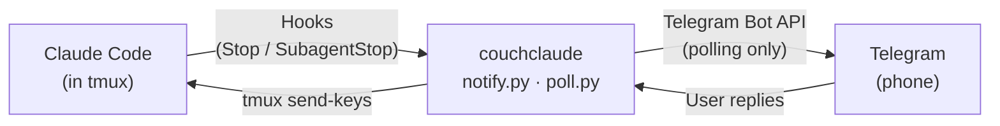
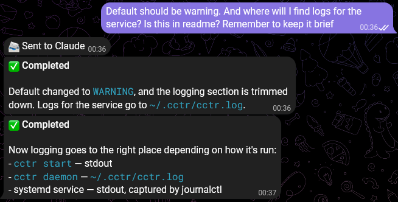
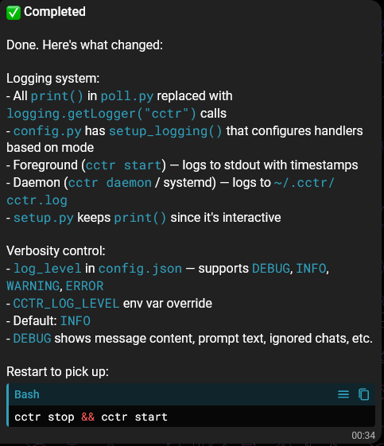
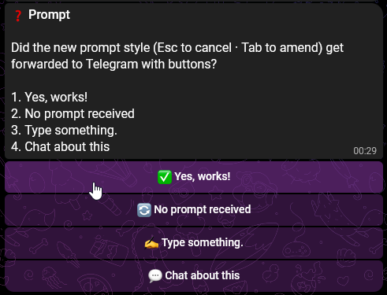

# couchclaude — Claude Code Telegram Remote

Monitor and interact with Claude Code sessions from your phone via Telegram. No webhooks, no exposed ports — just outbound polling.

## How It Works



When Claude finishes a task or asks a question, a hook sends the output to Telegram. You reply from your phone and the message gets injected into the tmux session. You can also send photos, files, commands, and answer permission prompts — all from Telegram.

## Prerequisites

- **Claude Code** — installed and working ([docs](https://docs.anthropic.com/en/docs/claude-code))
- **Python 3.8+** with `requests` — `pip install requests`
- **tmux** — `sudo apt install tmux` (or your package manager)
- **A Telegram bot** — create one via [@BotFather](https://t.me/BotFather) and save the token

## Installation

```bash
# Clone the repo
git clone <repo-url> ~/.couchclaude
cd ~/.couchclaude

# Install the only dependency
pip install requests

# Make the CLI executable and add to PATH
chmod +x couchclaude
mkdir -p ~/bin && ln -sf ~/.couchclaude/couchclaude ~/bin/couchclaude

# Ensure ~/bin is in your PATH (add to ~/.bashrc if needed)
export PATH="$HOME/bin:$PATH"
```

## Setup

```bash
couchclaude setup
```

This walks you through:
1. Entering your Telegram bot token
2. Detecting your chat ID (send a message to the bot when prompted)
3. Choosing your tmux session name (default: `claude`)
4. Installing Claude Code hooks into `~/.claude/settings.json`
5. Optionally installing a systemd user service

## Usage

```bash
# 1. Start Claude Code in a tmux session
tmux new-session -s claude  # If session existed already, attach to it with `tmux attach -t claude`
claude


# 2. In another terminal, start the polling daemon
couchclaude start
```

You'll get a "couchclaude online" message on Telegram. You're ready to go.


### CLI Commands
These are commands that are run in the machine running claude, in CLI.
```
couchclaude setup       Interactive first-time setup
couchclaude start       Start the polling daemon (foreground)
couchclaude daemon      Start as a background process
couchclaude stop        Stop the background daemon
couchclaude status      Show daemon and session status
couchclaude notify      Send notification (used by hooks)
couchclaude test        Send a test message to Telegram
couchclaude view        Capture and display current tmux screen
```

### Telegram Commands
These are commands you send to the bot, for some interactions with couchclaude. For instance, `/view ` is very useful to know what is happening in the Claude Code screen even before Claude has finished working and provided a response.

| Command | Description |
|---------|-------------|
| `/ping` | Check if couchclaude is online (responds with uptime) |
| `/status` | Show tmux session info (CWD, running command) |
| `/view` | Capture last 50 lines of the terminal |
| `/esc` | Send Escape key (exit menus, cancel prompts) |
| `/cd <path>` | Change directory in the tmux session |
| `/cmd <command>` | Run a shell command in tmux |
| `/help` | List available commands |

### Sending Messages

- **Text** — typed directly into the Claude Code session as input
- **Photos** — downloaded and passed to Claude with the file path (Claude can read images)
- **Files** — downloaded and passed to Claude with the file path

Make adjustments on the way, and receive responses from Claude Code:



Responses look nice, Markdown rendered:



### Permission Prompts

When Claude Code asks a permission question (e.g., "Do you want to make this edit?"), couchclaude detects it and sends it to Telegram with **inline buttons** for each option. Tap a button to respond instantly.



### Hitting limits

You get notified whe you reached any limits:


## Running as a systemd Service

```bash
mkdir -p ~/.config/systemd/user
cp ~/.couchclaude/couchclaude.service ~/.config/systemd/user/
systemctl --user daemon-reload
systemctl --user enable --now couchclaude
```

Check logs: `journalctl --user -u couchclaude -f`

**WSL2 note:** Enable lingering so the service survives logout:
```bash
loginctl enable-linger $USER
```

## Configuration

Stored at `~/.couchclaude/config.json` (created by `couchclaude setup`):

```json
{
  "telegram_bot_token": "YOUR_BOT_TOKEN",
  "telegram_chat_id": 123456789,
  "tmux_session": "claude",
  "max_message_length": 4000,
  "poll_interval": 2,
  "log_level": "INFO"
}
```

| Field | Description | Default |
|-------|-------------|---------|
| `telegram_bot_token` | Bot token from @BotFather | (required) |
| `telegram_chat_id` | Your Telegram chat ID | (required) |
| `tmux_session` | Name of the tmux session | `claude` |
| `max_message_length` | Max chars per notification | `4000` |
| `poll_interval` | Seconds between retries on error | `2` |
| `log_level` | `DEBUG`, `INFO`, `WARNING`, `ERROR` | `WARNING` |

Environment variables override the config file:
- `COUCHCLAUDE_BOT_TOKEN`, `COUCHCLAUDE_CHAT_ID`, `COUCHCLAUDE_TMUX_SESSION`, `COUCHCLAUDE_LOG_LEVEL`

### Logging

Foreground (`couchclaude start`) logs to stdout. Daemon (`couchclaude daemon`) logs to `~/.couchclaude/couchclaude.log`. systemd logs to journalctl (`journalctl --user -u couchclaude -f`). Set `log_level` to `DEBUG` for troubleshooting.

## Features

**Working:**
- Push notifications when Claude finishes a task or asks a question (via hooks)
- Reply from Telegram — messages injected into tmux as keystrokes
- Send photos and files — downloaded and forwarded to Claude (it can read images)
- Permission prompt detection with inline buttons — tap to respond
- Telegram commands: `/status`, `/view`, `/cmd`, `/cd`, `/ping`, `/esc`
- `/esc` command — send Escape to exit menus, cancel prompts, unblock stuck states
- Rate limit detection with recovery notification when limit resets
- Markdown-formatted notifications with plain text fallback
- Safe hooks — never interfere with Claude Code, even when couchclaude is offline
- systemd service support for background operation

**Planned:**
- `/history` command — show recent exchanges without raw terminal output
- Notification filtering — skip trivial responses to reduce noise
- Voice message transcription — send voice notes from Telegram

## Notes

- **Hooks are safe to leave installed.** `notify.py` always exits with code 0, even when couchclaude is not configured or the daemon is offline. Claude Code is never affected.
- **Notifications are clean.** Only Claude's text output is sent — no tool calls, file diffs, or terminal noise. Messages render with Markdown formatting, with automatic fallback to plain text.
- **Only your chat ID is accepted.** Messages from other Telegram users are silently ignored.
- **No inbound connections.** All communication is outbound polling to the Telegram API.

## Security

- `config.json` is created with `0600` permissions (owner-only)
- Only messages from the configured `chat_id` are processed
- The bot token grants access to inject text into your terminal — keep it private
- `/cmd` runs shell commands through tmux — intentional, but powerful
